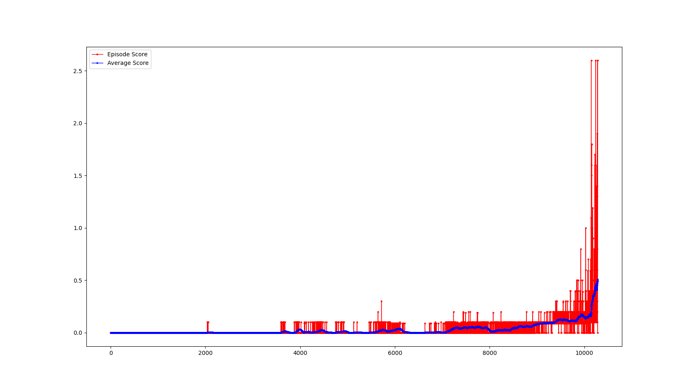
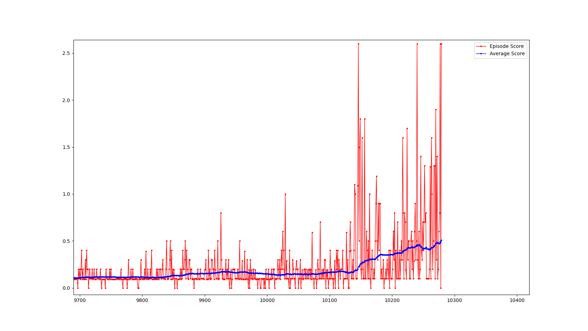

# Report
Learning algorithm used to solve environment is MADDPG - Multi Agent Deep Deterministic Policy Gradient.

MADDPG uses multiple DDPG agents to solve the task. In Tennis environment two agents were used.

Each DDPG agent collects experiences  and stores these experience samples into a replay buffer. 
On every n steps, the agent pulls out a batch from the replay buffer that is sampled at random. 
The agent then uses this batch to calculate a bootstrapped TD target and train a Q-function. 

In MADDPG we use deterministic policies to approximate greedy action. We directly approximate the best action 
in the next state using a policy function, then we use that action with the Q-function to get the max value.

In MADDPG we use off-policy exploration strategy. In this project Ornstein-Uhlenbeck Process was used as exploration 
strategy.

### Adjustable hyper parameters in algorithm contains:  
  - `policy learning rate` - learning rate for optimizer, determines step while minimizing loss function.
  - `value learning rate` - learning rate for optimizer, determines step while minimizing loss function.
  - `weight decay` - amount of penalty added to the cost which can lower model weights.
  - `gamma` - discount value for rewards. Determines how much past rewards are valued. Used for calculating q value.
  - `tau` - used for updating target model. Determines update rate from online model.
  - `buffer size` - maximum size of replay buffer. Determines how many experiences are stored at once.
  - `batch size` - size of batch used for training. Determines size of experiences batch used for learning.
  - `learn_every` - steps interval. Learning will occur every `learn_every` steps.

Algorithm has the highest performance when hyper parameters are set to:
  - `policy learning rate`: 0.0001 
  - `value learning rate`: 0.001 
  - `weight decay`: 0
  - `gamma`: 0.99
  - `tau`: 0.001
  - `buffer size`:1000000
  - `batch size`: 512
  - `learn_every`: 4

### Ornstein Uhlenbeck Process Parameters
  - `mu` - represents a long-term mean of the OU process
  - `theta` - mean reverting speed value
  - `sigma` - deviation of stochastic factor

Algorithm has the highest performance when hyper parameters are set to:
  - `mu`: 0.0
  - `theta`: 0.001
  - `sigma`: 0.002

Agent with such hyper parameters solved the environment in 10179 episodes.

### Training Results

#### Zoomed last 300 episodes

### Ideas for future work
 - Solve Soccer environment using MADDPG
 - Learn agent to play chess